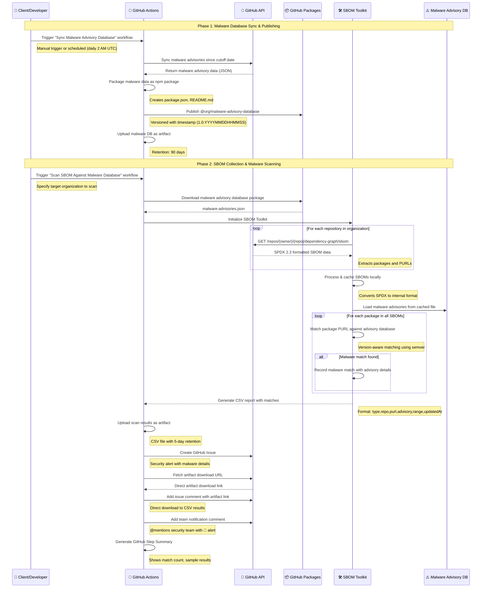
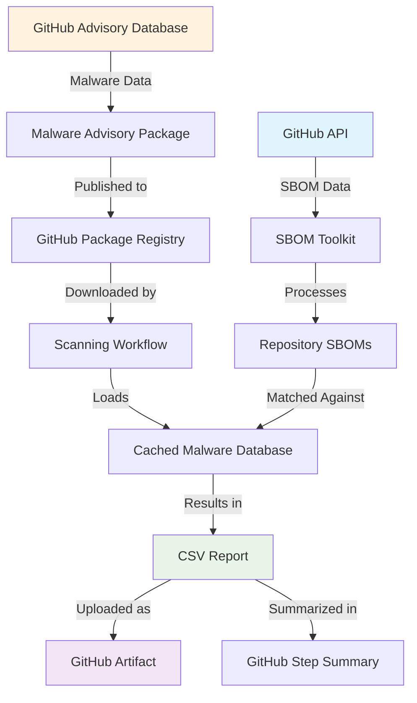

# GitHub SBOM Toolkit - Malware Detection Workflow

## Overview

This document outlines the complete workflow for detecting malware in software dependencies using GitHub's SBOM (Software Bill of Materials) data and malware advisory databases.

## Prerequisites & Setup

Before running the malware detection workflows, you need to configure the following repository settings:

### 1. Repository Secrets

Navigate to **Settings → Secrets and variables → Actions → Secrets** and create:

#### `PERSONAL_GITHUB_TOKEN` (Required)
- **Purpose**: Authenticates with GitHub API and Package Registry
- **Scopes Required**:
  - `repo` (Full repository access)
  - `read:packages` (Download packages from GitHub Packages)
  - `write:packages` (Publish packages to GitHub Packages)
  - `read:org` (Read organization data for SBOM scanning)
- **How to Create**:
  1. Go to **GitHub Settings → Developer settings → Personal access tokens → Tokens (classic)**
  2. Click "Generate new token (classic)"
  3. Select the required scopes listed above
  4. Generate and copy the token
  5. Add it as a repository secret named `PERSONAL_GITHUB_TOKEN`

> **Note**: The built-in `GITHUB_TOKEN` is automatically available but has limited permissions. `PERSONAL_GITHUB_TOKEN` is required for cross-repository operations.

### 2. Repository Variables

Navigate to **Settings → Secrets and variables → Actions → Variables** and create:

#### `SECURITY_TEAM_ASSIGNEES` (Optional)
- **Purpose**: Comma-separated list of GitHub usernames to assign to security issues
- **Example**: `john-doe,jane-smith,security-lead`
- **Validation**: The workflow validates that users exist before assignment
- **Format**: Comma-separated, no spaces, no @ symbols

#### `SECURITY_TEAM_TAG` (Optional)
- **Purpose**: Team slug or username to mention in issue notifications
- **Example**: `security-team` or `security-team-lead`
- **Format**: Team slug without @ symbol (it will be added automatically)
- **Note**: For team mentions, use format `org/team-name` (e.g., `advanced-security/security-team`)

### 3. Repository Labels

The workflow automatically assigns labels to created issues. Ensure these labels exist in your repository:

Navigate to **Settings → Issues → Labels** and create if missing:

| Label | Color | Description |
|-------|-------|-------------|
| `security` | `#d73a4a` (red) | Security-related issues |
| `malware` | `#d93f0b` (dark red) | Malware detection alerts |
| `sbom` | `#0e8a16` (green) | SBOM scanning related |

**Quick Setup Command** (using GitHub CLI):
```bash
gh label create security --color d73a4a --description "Security-related issues" --repo owner/repo
gh label create malware --color d93f0b --description "Malware detection alerts" --repo owner/repo
gh label create sbom --color 0e8a16 --description "SBOM scanning related" --repo owner/repo
```

### 4. Workflow Permissions

Ensure the workflow has proper permissions by verifying in the workflow file:

```yaml
permissions:
  contents: read      # Read repository contents
  packages: read      # Access GitHub Packages
  issues: write       # Create and comment on issues
```

### 5. GitHub Packages Access

For publishing and downloading malware advisory database:

1. **Package Registry URL**: `https://npm.pkg.github.com`
2. **Package Name**: `@{organization}/malware-advisory-database`
3. **Authentication**: Uses `PERSONAL_GITHUB_TOKEN`

### Setup Checklist

- [ ] Create `PERSONAL_GITHUB_TOKEN` with required scopes
- [ ] Add token as repository secret
- [ ] Create `SECURITY_TEAM_ASSIGNEES` variable (optional)
- [ ] Create `SECURITY_TEAM_TAG` variable (optional)
- [ ] Create required labels: `security`, `malware`, `sbom`
- [ ] Verify workflow permissions in YAML files
- [ ] Test workflow with manual trigger

## Architecture Flow Diagram



## Detailed Workflow Steps

### Phase 1: Malware Database Sync & Publishing

#### Workflow: `malware-advisory.yml`

**Trigger Options:**
- Manual dispatch with cutoff date parameter
- Scheduled daily at 2 AM UTC (commented out)

**Steps:**

1. **Setup Environment**
   ```bash
   # Install dependencies and build TypeScript
   npm ci && npm run build
   ```

2. **Sync Malware Advisory Database**
   ```bash
   # Download malware advisories since specified cutoff date
   npm run start -- --sync-malware \
     --malware-cache malware-cache \
     --malware-since "2025-11-25T00:00:00Z" \
     --token "$GITHUB_TOKEN" \
     --sbom-cache .sbom-cache-temp
   ```

3. **Package & Publish to GitHub Packages**
   ```bash
   # Create npm package structure
   mkdir malware-advisory-package
   cp malware-cache/malware-advisories.json malware-advisory-package/
   
   # Generate package.json with timestamp version
   version="1.0.$(date +%Y%m%d%H%M%S)"
   ```

4. **Publish Package**
   ```bash
   # Publish to GitHub Package Registry
   npm publish @{organization}/malware-advisory-database
   ```

### Phase 2: SBOM Collection & Malware Scanning

#### Workflow: `scan-sbom-with-malware-db.yml`

**Trigger Options:**
- Manual dispatch with organization parameter
- Pull request events
- Push to main branch

**Steps:**

1. **Setup Environment**
   ```bash
   npm ci && npm run build
   ```

2. **Download Malware Database**
   ```bash
   # Configure npm for GitHub Packages
   echo "@{org}:registry=https://npm.pkg.github.com" > .npmrc
   echo "//npm.pkg.github.com/:_authToken=$GITHUB_TOKEN" >> .npmrc
   
   # Install and extract malware database
   npm install @{organization}/malware-advisory-database
   cp node_modules/@{org}/malware-advisory-database/malware-advisories.json ./malware-cache/
   ```

3. **Collect SBOMs**
   ```bash
   # Fetch SBOMs for entire organization
   npm run start -- --sync-sboms \
     --org "InfoMGHAS-KR-Exercises" \
     --sbom-cache sboms \
     --token "$GITHUB_TOKEN" \
     --progress
   ```

4. **Scan for Malware**
   ```bash
   # Match SBOM packages against malware advisory database
   npm run start -- --sbom-cache sboms \
     --malware-cache malware-cache \
     --match-malware \
     --csv \
     --output-file malware-scan-results.csv
   ```

5. **Create GitHub Issue for Vulnerabilities**
   ```bash
   # Create issue with security alert
   # - Validates and assigns team members
   # - Fetches artifact download URL dynamically
   # - Creates formatted issue with scan details
   # - Adds comment with direct artifact download link
   # - Notifies security team with @mentions
   ```

   **Issue Creation Features:**
   - **Assignees**: Validates and assigns from `SECURITY_TEAM_ASSIGNEES` variable
   - **Labels**: Automatically tagged with `security`, `malware`, `sbom`
   - **Artifact Link**: Direct downloadable link to CSV results via GitHub API
   - **Team Notifications**: Mentions configured team from `SECURITY_TEAM_TAG` variable
   - **Security Alert**: 🚨 Red alert icon with priority and vulnerability count

6. **Generate Results**
   - Upload CSV artifact (5-day retention)
   - Create GitHub Issue with:
     - 🚨 Security alert title with malware count
     - Detailed scan information (org, date, workflow run)
     - Results summary with vulnerability count
     - Direct artifact download link (fetched via API)
     - Team mention notifications with 🚨 alert
   - Create GitHub Step Summary with:
     - Organization scanned
     - Total advisories checked
     - Number of malware matches found
     - Sample results preview

## Data Flow Architecture



## Key Components

### 1. SBOM Processing
- **Format**: SPDX 2.3 JSON from GitHub Dependency Graph
- **Package Identification**: Uses Package URLs (PURLs)
- **Scope**: Organization-wide repository scanning
- **Caching**: Local filesystem cache for incremental updates

### 2. Malware Advisory Database
- **Source**: GitHub Security Advisory Database
- **Distribution**: GitHub Package Registry
- **Format**: JSON array of malware advisories
- **Versioning**: Timestamp-based semantic versioning

### 3. Matching Algorithm
- **Method**: Version-aware PURL matching
- **Libraries**: Uses semver for range matching
- **Ecosystems**: Supports npm, PyPI, Maven, Go, etc.
- **Output**: Structured CSV with advisory details

### 4. Results & Reporting
- **Artifacts**: CSV files with 30-day retention
- **GitHub Issues**: Automatically created with security alerts
- **Assignees**: Team members validated and assigned from repository variables
- **Notifications**: Security team mentioned via @team tags
- **Artifact Links**: Direct downloadable URLs fetched via GitHub API
- **Summary**: GitHub Step Summary with key metrics
- **Format**: Machine-readable CSV for further processing

## Example Output

### CSV Report Format
```csv
type,repo,purl,reason_or_advisory,range,updatedAt
malware,InfoMGHAS-KR-Exercises/mona-gallery,pkg:npm/%40browserbasehq/stagehand@3.0.4,GHSA-mmp7-557c-74pq,'= 3.0.4,2025-11-26T03:11:44Z
```

### GitHub Step Summary
```markdown
## 📊 SBOM Scan Summary
- **Organization Scanned**: InfoMGHAS-KR-Exercises
- **Scan Date**: 2025-12-04 16:39:22 UTC
- **Malware Advisories Checked**: 2,847
- **🚨 Malware Matches Found**: 1

### 🚨 Sample Matches (first 5)
```csv
type,repo,purl,reason_or_advisory,range,updatedAt
malware,InfoMGHAS-KR-Exercises/mona-gallery,pkg:npm/%40browserbasehq/stagehand@3.0.4,GHSA-mmp7-557c-74pq,'= 3.0.4,2025-11-26T03:11:44Z
```

## Security Considerations

1. **Token Permissions**: Requires `contents:read`, `packages:read`, and `issues:write`
2. **Data Retention**: Malware DB artifacts kept for 90 days, scan results for 5 days
3. **Artifact Distribution**: Direct artifact URLs (not gists) for secure result sharing
4. **Incremental Updates**: Only scans repositories modified since last run
5. **Rate Limiting**: Built-in delays and retry logic for GitHub API calls
6. **Team Notifications**: Configurable security team mentions via repository variables

## Automation Benefits

1. **Proactive Detection**: Identifies malware before deployment
2. **Organization-wide Coverage**: Scans all repositories in specified organization
3. **Continuous Monitoring**: Can be scheduled for regular execution
4. **Automated Issue Creation**: Creates GitHub issues with security alerts automatically
5. **Team Notifications**: Automatically notifies configured security teams with @mentions
6. **Direct Artifact Access**: Provides immediate downloadable links to scan results
7. **Actionable Results**: Provides specific advisory IDs and affected versions
8. **Integration Ready**: CSV output suitable for SIEM/ticketing system integration
9. **Configurable Assignments**: Validates and assigns team members from repository variables
